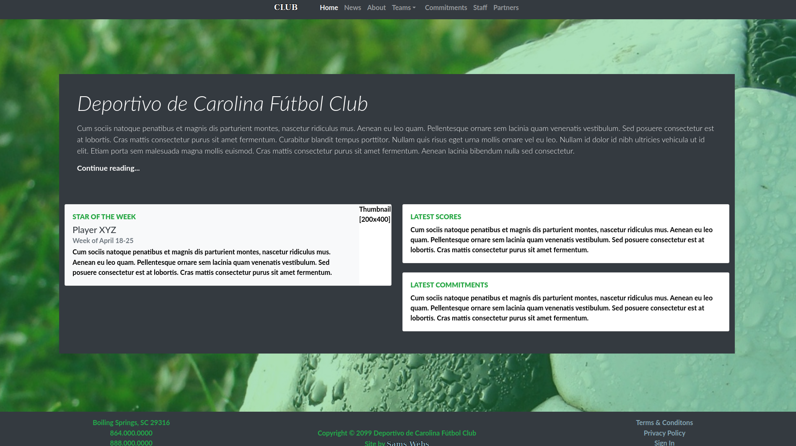
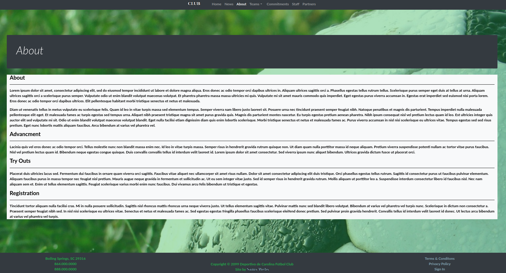
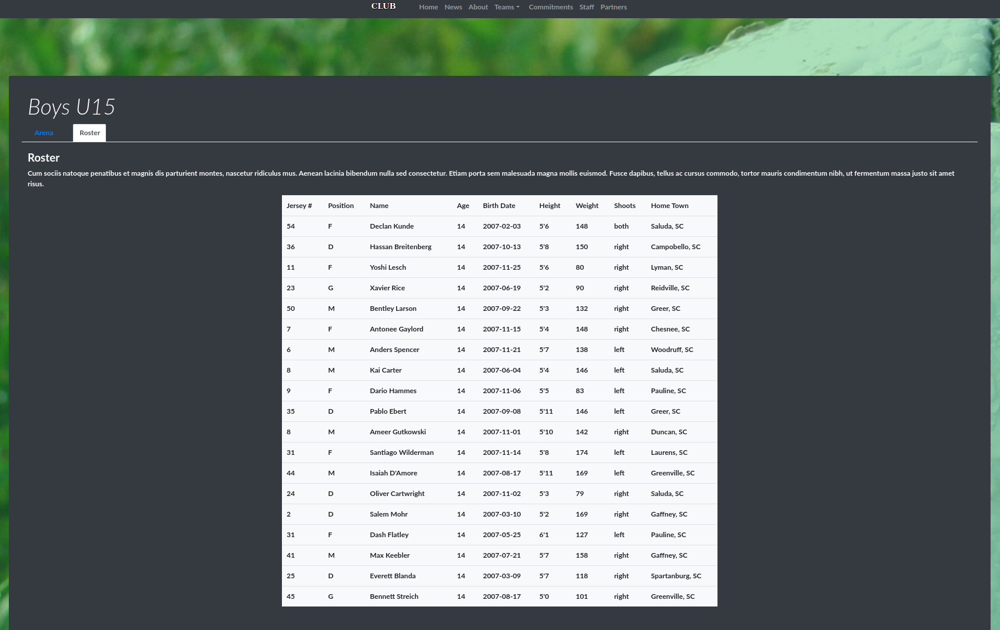
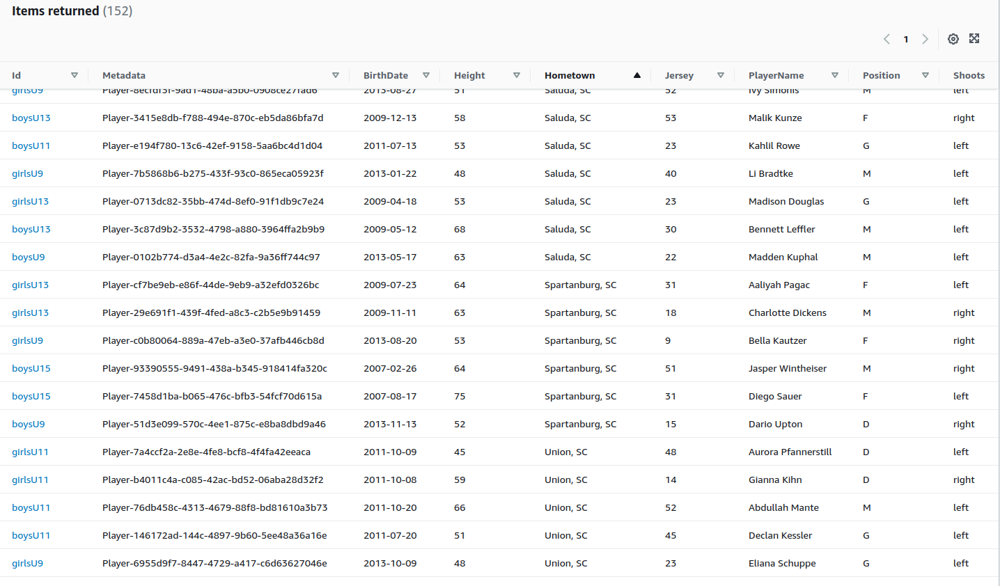

# Example Site - Deportivo de Carolina Fútbol Club

A full-stack application using React, GraphQL, & Amazon Web Services (API Gateway + Cloudfront + DynamoDb + Lambda + S3).






For a KeystoneJS 4.0 example abandoned March 2019, see the `abandoned` branch.

## Pre-requisites

First of all, these instructions will only be targeting Debian-based distros (Ubuntu, Linux Mint, etc.) but they can also work under [Windows using the Windows Subsystem for Linux (WSL)](https://docs.microsoft.com/en-us/windows/wsl/about).  The following tools need to be installed:

- Install [direnv](https://direnv.net).
- Install [Docker](https://www.docker.com).
- Install [NodeJS](https://nodejs.org/en/download/).
- Install [AWS CLI](https://docs.aws.amazon.com/cli/latest/userguide/cli-chap-getting-started.html).
- For deployments to AWS, a [Serverless account](https://app.serverless.com/).

### Installing Node Version Manager (NVM)

```bash
wget -qO- https://raw.githubusercontent.com/nvm-sh/nvm/v0.35.3/install.sh | bash
echo 'export NVM_DIR="$HOME/.nvm"
[ -s "$NVM_DIR/nvm.sh" ] && \. "$NVM_DIR/nvm.sh"  # This loads nvm
[ -s "$NVM_DIR/bash_completion" ] && \. "$NVM_DIR/bash_completion"' >> ~/.bashrc
source ~/.bashrc
nvm install lts/fermium # Node 14x because it's 2022 and Amazon hasn't upgraded their framework yet...
```

## Development

### Getting Both Backend/Frontend Configured

This can be done by executing the following:

```bash
# ROOT - Execute the following commands in the root (./) folder:
nvm use                                 # use the version of NodeJS listed in .nvmrc
npm i -g serverless                     # installs Serverless globally to your lts/fermium install

cd backend && npm i && npm audit fix                # install the backend packages listed in package.json
cd frontend && npm i && npm audit fix --production  # install the frontend packages listed in package.json
npm i && npm audit fix                              # install the root packages listed in package.json

cp .envrc.example .envrc                # IMPORTANT! Edit file and set your environment variables in .envrc
direnv allow                            # refreshes variables in your PATH

serverless login                        # will open a browser, we'll need to be logged in for backend/frontend steps

# BACKEND - Execute  the following commands in the backend folder:
cp docs/serverless.yml.example serverless.yml   # IMPORTANT! Edit file and set your Serverless 'org' and your TOKEN_SECRET
serverless --org=<YOUR SERVERLESS ORG>          # IMPORTANT! Create the app/service on Serverless.com. 
#Do you want to deploy now? No                  # IMPORTANT! We can do this later.     

# FRONTEND - Execute  the following commands in the frontend folder:
cp docs/serverless.yml.example serverless.yml   # IMPORTANT! Edit file and set your Serverless 'org' and your REACT_APP_TOKEN_SECRET
serverless --org=<YOUR SERVERLESS ORG>          # IMPORTANT! Create the app/service on Serverless.com.   
#Do you want to deploy now? No                  # IMPORTANT! We can do this later.     
```

### Getting Both Backend/Frontend Started

If the steps in `Getting Both Backend/Frontend Configured` have been satisifed, back in the root of the repository execute the following:

```bash
docker-compose pull     # pull the DynamoDB Docker container
docker-compose up -d    # Execute the Docker container

npm run backend:seed    # create and seed the Deportivo-development table
npm run dev             # concurrently starts both the frontend web site and backend api.
```

## Testing

Before running tests, make sure you have the DynamoDB Docker container running by execute `docker-compose up -d` in the root of the repository.  The backend tests require use of the DynamoDB Docker container, so you'll also need to add dummy credentials to your `~/.aws/credentials` file.  You can just perform the following to do so:

```bash
echo "
[localhost-user]
aws_access_key_id = 
aws_secret_access_key = 
" >> ~/.aws/credentials
```

Then to perform tests on the backend, execute `npm run test:backend`.  To perform tests on the frontend, execute `npm run test:frontend`.  Both steps should be performed in the root of the repository.

## Deploying To Amazon Web Services

Deploy any branch to whatever environment (staging, production) by executing (replace `ENVIRONMENT` with desired):

```bash
serverless deploy --stage ENVIRONMENT
```

## TODO

### Backend

- Improve tests.
- Update type defs to use GraphQL types.
- Implement an aunthentication shield for the GraphQL API.
- Implement a GraphQL subscription for the news feed.
- Implement a GraphQL subscription for the team feed.
- Add additional mutations.

### Frontend

- Improve tests.
- Add content editor components for home, news, teams, and static.
