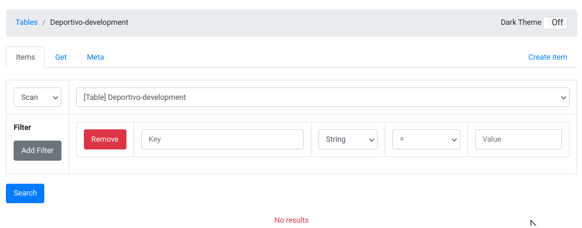

# Example Site - Deportivo de Carolina Fútbol Club

A full-stack application using JavaScript for frontend ([React](https://react.dev/)), backend ([Express](https://expressjs.com/)), and a serverless NoSQL database ([AWS DynamoDB](https://aws.amazon.com/dynamodb/)).


For a KeystoneJS 4.0 example abandoned March 2019, see the `abandoned` branch.

## Pre-requisites

To run the service, you will need to install the following tools.

* [NodeJS](https://nodejs.org/en/)
* [Docker](https://www.docker.com/)

The below are optional but highly recommended:

* [nvm](https://github.com/nvm-sh/nvm) - Used to manage NodeJS versions.
* [Direnv](https://direnv.net/) - Used to manage environment variables.
- Install [direnv](https://direnv.net) for persisting environment variables needed for development.
- Install [AWS CLI](https://docs.aws.amazon.com/cli/latest/userguide/cli-chap-getting-started.html).

For the AWS CLI, you'll need to configure your credentials.  You can do so by executing the following:

## Getting Started

First, we'll need to set up our environment variables.  You can do this by either:

* Manually exporting the necessary environment variables in your shell.  These are listed in the [`./envrc.example`](./envrc.example) file.

or

* Use optionally use **Direnv**.

```bash
cp .envrc.example .envrc
direnv allow
```

### Install Node.js Packages

Execute the following within your terminal:

```bash
nvm use                                 # To eliminate any issues, install/use the version listed in .nvmrc.
npm i                                   # Install packages needed for the repository root
cd frontend && npm i --legacy-peer-deps # Install packages needed for the frontend
cd backend && npm                       # Install packages needed for the backend
cd ..                                   # Navigate back to the root of the repository
```

### Create the database

Finally, let's create and seed the `Deportivo-development` database, simply run `npm run seed`.  However, be careful as this command re-creates the database every execution of it.

## Development

To run both the frontend and backend concurrently:

```bash
docker-compose up -d  # runs the database in the background
npm run dev           # runs both the frontend and backend
```

Also, you just execute the backend via `npm run dev:backend`.  to verify the backend is working:

```bash
curl http://localhost:$API_PORT/about
```

Also, you shoud be able to create a team:

```bash
# First, grab an access token provided by the backend API
ACCESS_TOKEN=$(curl -s -X GET \
  -H 'accept: application/json' \
  'http://localhost:4040/api/token' | jq -r '.token')

# Creating a team
curl -X POST \
-H "Content-Type: application/json" \
-H "Authorization: Bearer $ACCESS_TOKEN" \
-d '{ "query": "mutation { createTeam(input: { teamId: \"test-team-1\", teamName: \"Test Team\", arena: \"Test Team Arena\" }) { Id Metadata TeamName Arena } }"}' \
http://localhost:4040/api/graphql

# Retrieving the team we just created
curl -X POST \
-H "Content-Type: application/json" \
-H "Authorization: Bearer $ACCESS_TOKEN" \
-d '{ "query":"query { team(teamId: \"test-team-1\") { Id Metadata TeamName Arena  } }"}' \
http://localhost:4040/api/graphql
```

You can also acces the Apollo GraphiQL (interactive test playground) instance at [http://localhost:$API_PORT/graphql](http://localhost:$API_PORT/graphql).


Additionally, you can visually view, create, or delete DynamoDB tables.  Navigate to [http://localhost:8001](http:/localhost:8001) in your browser to access.  This will require the `DYNAMO_ENPOINT` environment variable to be set in the terminal.  See `.envrc.example` for details.



## Testing

Both the backend and frontend utilizes [Jest](https://jestjs.io/).  To run these tests, simply execute `npm run test:frontend` or `npm run test:backend`.

