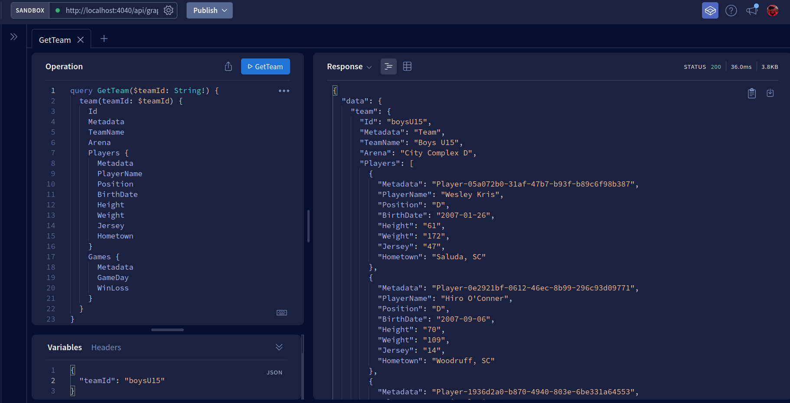

# Example AWS Lambda - Deportivo de Carolina Fútbol Club - Backend

This is an example Lambda for a GraphQL API using Apollo Server and DynamoDb.  Using the Serverless Framework, the example AWS Lambda is deployed with an API Gateway for the GraphQL endpoint, and a DynamoDb table for the data.




_TODO_:

- Write more tests, especially early to identify change points.
- Add delete mutations
- Utilize different types other than strings

## Test Invocations

### Offline


```bash
# Getting API details
curl -X GET \
-H "Content-Type: application/json" \
http://localhost:4040/api/about

# The result should resemble:
# {"name":"deportivo-carolina-backend","version":"0.9.7","description":"Example API using GraphQL and AWS DynamoDB SDK.","environment":"development"}

# If visiting http://localhost:4040/api/about in a web browser, the result should resemble the screen shot above.

# Creating a team
curl -X POST \
-H "Content-Type: application/json" \
-H "Authorization: Bearer $TOKEN_SECRET" \
-d '{
    "query":"mutation CreateTeam($input: CreateTeamInput!) { createTeam(input: $input) { Id Metadata TeamName Arena  } }",
    "variables": {"input":{"teamId":"test-team-1","teamName":"Test Team","arena":"Test Team Arena"}}
  }' \
http://localhost:4040/api/graphql

# The result should be:
# {"data":{"createTeam":{"Id":"test-team-1","Metadata":"Team","TeamName":"Test Team","Arena":"Test Team Arena"}}}

# Retrieving a team
curl -X POST \
-H "Content-Type: application/json" \
-H "Authorization: Bearer $TOKEN_SECRET" \
-d '{
    "query":"query { team(teamId: \"test-team-1\") { Id Metadata TeamName Arena  } }"
  }' \
http://localhost:4040/api/graphql

# The result should be:
# {"data":{"team":{"Id":"test-team-1","Metadata":"Team","TeamName":"Test Team","Arena":"Test Team Arena"}}}
```

### Deployed

```bash
# Getting API details
curl -X GET \
-H "Content-Type: application/json" \
https://xxxxxxxxxx.execute-api.us-east-1.amazonaws.com/api/about

# The result should resemble:
# {"name":"deportivo-carolina-backend","version":"0.9.7","description":"Example API using GraphQL and AWS DynamoDB SDK.","environment":"development"}

# Creating a team
curl -X POST \
-H "Content-Type: application/json" \
-H "Authorization: Bearer $TOKEN_SECRET" \
-d '{
    "query":"mutation CreateTeam($input: CreateTeamInput!) { createTeam(input: $input) { Id Metadata TeamName Arena  } }",
    "variables": {"input":{"teamId":"test-team-1","teamName":"Test Team","arena":"Test Team Arena"}}
  }' \
https://xxxxxxxxxx.execute-api.us-east-1.amazonaws.com/api/graphql

# The result should be:
# {"data":{"createTeam":{"Id":"test-team-1","Metadata":"Team","TeamName":"Test Team","Arena":"Test Team Arena"}}}

# Retrieving a team
curl -X POST \
-H "Content-Type: application/json" \
-H "Authorization: Bearer $TOKEN_SECRET" \
-d '{
    "query":"query { team(teamId: \"test-team-1\") { Id Metadata TeamName Arena  } }"
  }' \
https://xxxxxxxxxx.execute-api.us-east-1.amazonaws.com/api/graphql

# The result should be:
# {"data":{"team":{"Id":"test-team-1","Metadata":"Team","TeamName":"Test Team","Arena":"Test Team Arena"}}}
```
