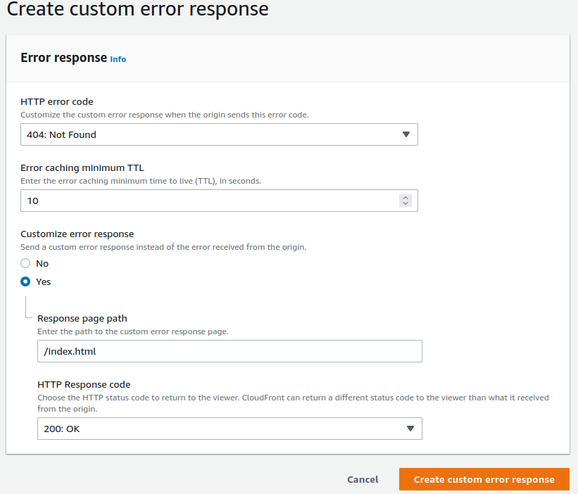

# Example Site - Deportivo de Carolina Fútbol Club - FrontEnd

This is a simple example of a React site that can be deployed to AWS using S3 to host the static files and Cloudfront to route the requests.

After deploying to AWS, you'll need to create a custom error response in [Cloudfront](https://console.aws.amazon.com/cloudfront/v3/home) to ensure our static React deployment routes as expected.

